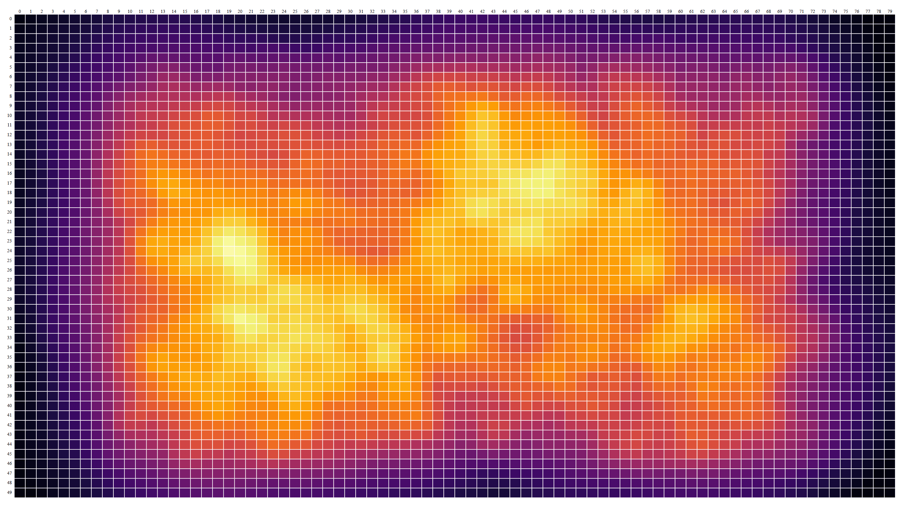
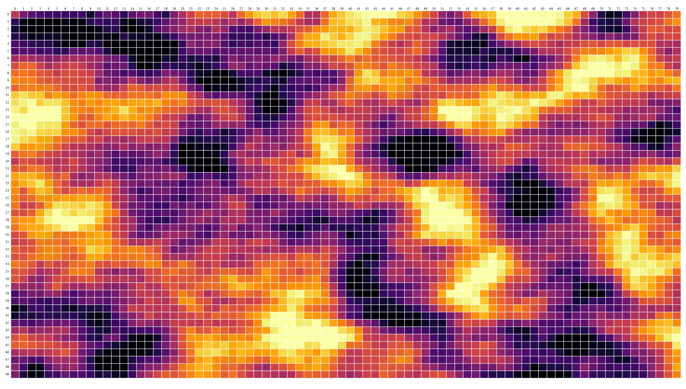
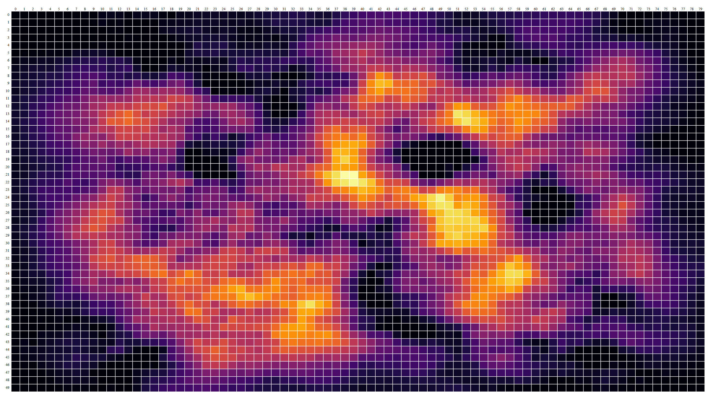
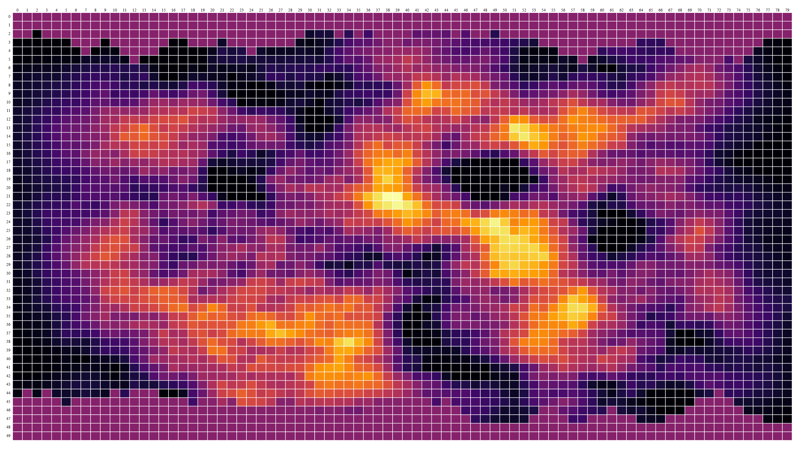

# Tytonic (WebAssembly Project)

These project use WebAssembly for re-create the generation
of a heightmap using as base code the library of Libtcod,
the generation of heightmap original was made with Python
and Tcod (Port of Libtcod for Python).

The version of Libtcod used for write in AssamblyScript 
files is [this](https://github.com/libtcod/libtcod/tree/34ae258a863c4f6446effee28ca8ecae51b1519f).

To visualize the Heightmap in the frontend, is used React
and D3.js, the tutorial used for recreate the Heightmap
with D3.js is [this](https://www.react-graph-gallery.com/heatmap).

### Showcase






### Instructions

To install dependencies:

```bash
bun install
```

To run:

```bash
bun run index.ts
```

This project was created using `bun init` in bun v1.1.7. [Bun](https://bun.sh) is a fast all-in-one JavaScript runtime.
